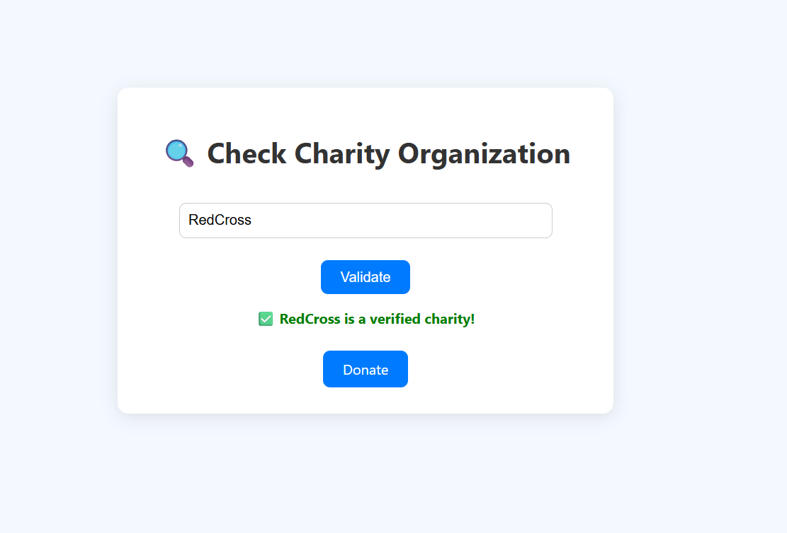
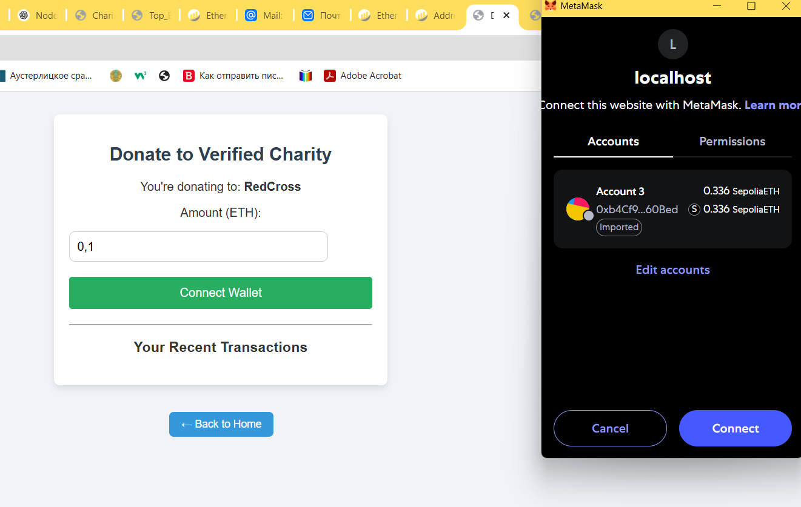
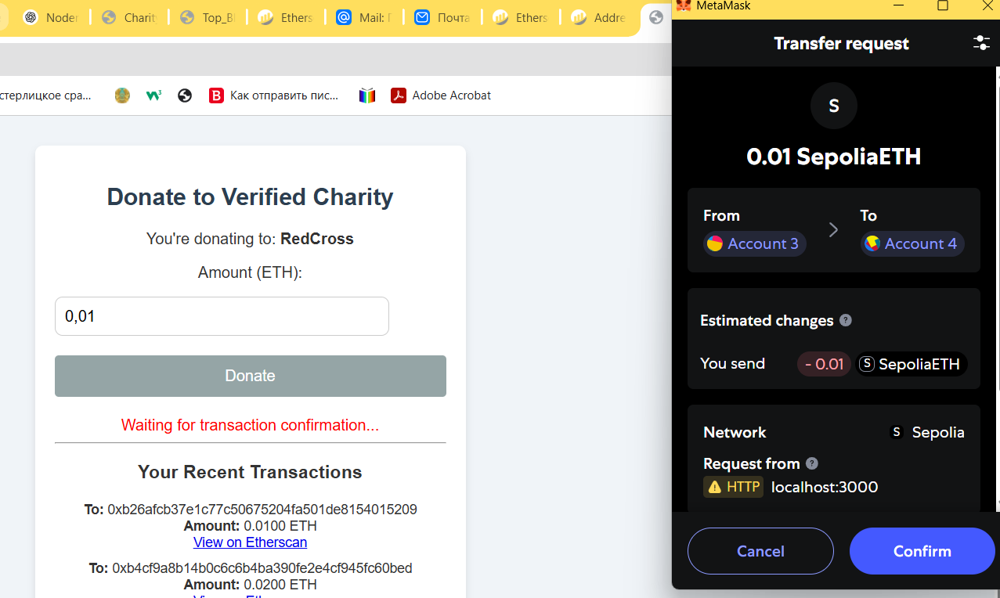
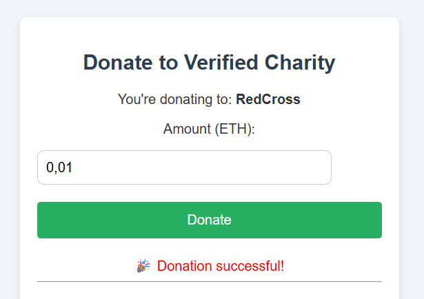
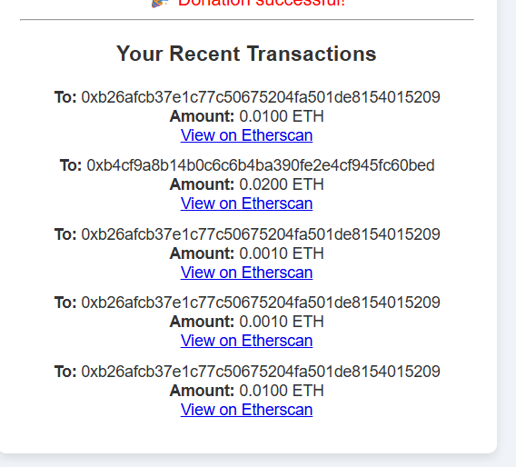

# CheckAnddonateToCharity

This is a simple Ethereum-based donation web application that allows users to donate ETH to a verified charity address using MetaMask. The project demonstrates interaction with the Ethereum blockchain and displays the user's recent transaction history.

## 🌐 Live Page

- Open `donate.html` in your browser
- Make sure MetaMask is installed and connected
- Use `?org=CharityName` in the URL to specify a charity (e.g., `donate.html?org=RedCross`)

---

## 🛠 Features

- ✅ Connect MetaMask wallet
- ✅ Enter and send a donation in ETH
- ✅ Send funds to a predefined verified charity address
- ✅ Display connected wallet address
- ✅ Fetch and display recent transactions from Etherscan
- ✅ Responsive, modern UI with basic styling

---

## ⚙️ How It Works

1. **Verify Charity Name**
   Before donating, users can inspect the organization name displayed on the page (e.g., RedCross) and verify it independently to ensure it's not a fake. Always double-check the official website or trusted sources.
   

3. **Connect Wallet**  
   Users must have MetaMask installed. When they click "Connect Wallet", the site connects to their Ethereum account.
   

5. **Send Donation**  
   The user enters an amount (in ETH) and clicks "Donate". The app sends a transaction to a predefined charity wallet address.
   
   

7. **Transaction History**  
   The app fetches the latest transactions from Etherscan for the connected wallet and displays them in a list.
   

---

## 📦 Technologies Used

- HTML5
- CSS3 (with embedded styles)
- Vanilla JavaScript
- MetaMask (Ethereum provider)
- Etherscan API (for transaction history)

---

## 🔐 Charity Wallet

```text
Charity Wallet Address:
0xb26Afcb37E1C77C50675204fA501De8154015209
